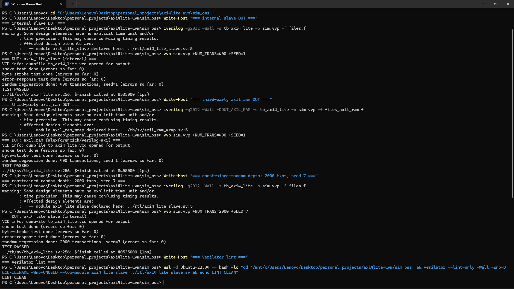
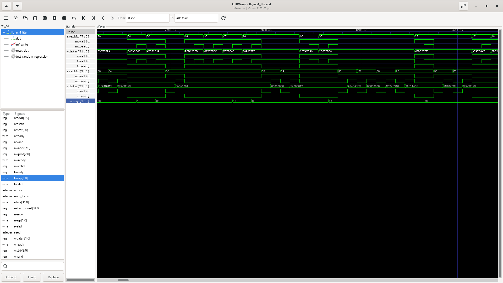

# AXI4-Lite UVM verification

A UVM environment for an AXI4-Lite slave, with a lighter self-checking
SystemVerilog testbench that runs on open-source tools (Icarus Verilog /
Verilator). Both drive two DUTs through the same interface: an internal
register-bank slave, and the `axil_ram` from alexforencich/verilog-axi.


## Demo

The open-source flow: the same self-checking testbench and reference-model
scoreboard passing against both DUTs (the internal register-bank slave and the
third-party `axil_ram`), a 2000-transaction random run, and Verilator lint.



The AXI4-Lite handshake in GTKWave: VALID held until READY on each channel, each
write answered by a B response, and `SLVERR`/`0xDEAD_DEAD` on out-of-range access.



## What's here

- A UVM testbench with the usual pieces: an agent (driver, monitor,
  sequencer), environment, scoreboard, a functional-coverage subscriber
  (register offset, response code, byte-strobe pattern, direction crosses),
  and a register layer (RAL) with bus adapter and predictor. Directed and
  constrained-random tests, plus bindable SVA for the AXI4-Lite handshake and
  stability rules.
- An open-source flow under `sim_oss/` that only needs `iverilog` or
  `verilator`. The self-checking testbench runs in CI against both DUTs on
  every push.

## The two DUTs

`rtl/axi4_lite_slave.sv` is a 16x32 register bank with byte-strobe writes and
`SLVERR` on out-of-range access:

| Offset | Name | Access | Notes |
|-------:|------|:------:|-------|
| `0x00` | CTRL | RW | `CTRL[0]` is an enable bit |
| `0x04` | STATUS | RO | `[0]` mirrors `CTRL[0]`; `[31:16]` counts accepted writes |
| `0x08` | SCRATCH | RW | full byte-strobe support |
| `0x0C` | ID | RO | constant `0x5A5A_0001`, writes ignored |
| `0x10`-`0x3C` | SCRATCH[4..15] | RW | more scratch registers |
| `>= 0x40` | — | — | out of range: `SLVERR`, reads return `0xDEAD_DEAD` |

`axil_ram` (submodule under `rtl/third_party/verilog-axi/`) is a plain
AXI4-Lite RAM: every aligned address is read/write and there is no `SLVERR`.
`tb/sv/axil_ram_wrap.sv` renames its `s_axil_*` ports and inverts the reset so
the same testbench drives either DUT.

## Layout

```
axi4lite-uvm/
├── rtl/
│   ├── axi4_lite_slave.sv
│   └── third_party/verilog-axi/    # submodule: alexforencich/verilog-axi
├── tb/
│   ├── sva/axi4_lite_assertions.sv # bindable protocol assertions
│   ├── sv/                         # self-checking testbench + axil_ram wrapper
│   └── uvm/                        # agent, env, scoreboard, RAL, sequences, tests
├── sim_oss/                        # Icarus/Verilator flow
├── sim/Makefile                    # Questa / VCS / Xcelium
└── .github/workflows/ci.yml
```

## Running it

Open source:

```bash
cd sim_oss
make                          # DUT=internal
make DUT=axil_ram             # third-party DUT
make both                     # both DUTs
make NUM_TRANS=2000 SEED=7    # longer random regression
make lint                     # Verilator lint (both DUTs)
```

The testbench drives the selected DUT with an AXI4-Lite BFM and checks every
transaction against an inline reference model: the register map for the
internal slave, a plain memory for `axil_ram`.

UVM:

```bash
cd sim
make questa TEST=axi4_lite_regression_test   # or: make vcs / make xrun
make cov                                     # coverage report
```

`tb_top` picks the DUT with `+define+DUT_AXIL_RAM` (default is the internal
slave), and the scoreboard carries a matching reference model.

## Verification plan

Internal slave:

| Feature | Stimulus | Check |
|---------|----------|-------|
| Single read/write | directed + random | scoreboard data + response |
| Byte-strobe partial writes | `strobe` sequence | lane-accurate merge |
| Read-only registers (STATUS/ID) | directed writes ignored | value unchanged |
| Out-of-range access | `error` sequence | `SLVERR`, `0xDEAD_DEAD` on read |
| Handshake/stability | all traffic | SVA assertions |

Third-party `axil_ram`:

| Feature | Stimulus | Check |
|---------|----------|-------|
| Read-after-write consistency | random addr/data | memory scoreboard |
| Full address space | random aligned addresses | all OKAY |
| Byte-strobe partial writes | random WSTRB | lane-accurate scoreboard |
| Handshake/stability | all traffic | SVA assertions |

## Waveforms

Both flows dump a VCD (`tb_top.vcd` / `sim_oss/tb_axi4_lite.vcd`) for GTKWave
or Surfer.

## Credits

The UVM environment (agent, scoreboard, coverage, RAL, sequences), the SVA,
the self-checking testbench and the verification plan are my own work. It uses
the Accellera UVM library, alexforencich/verilog-axi for the `axil_ram` DUT,
and Icarus Verilog / Verilator.
